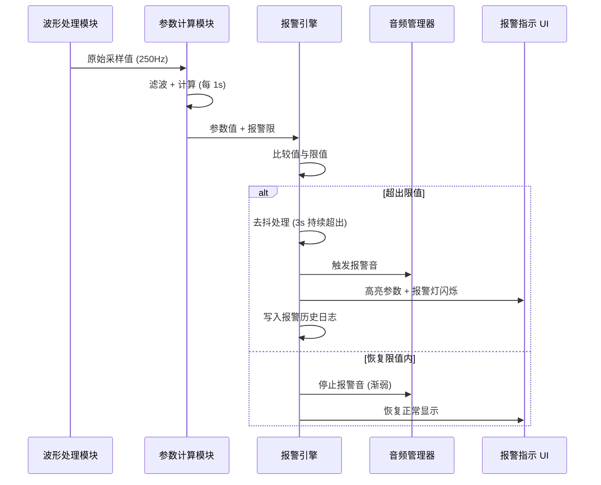
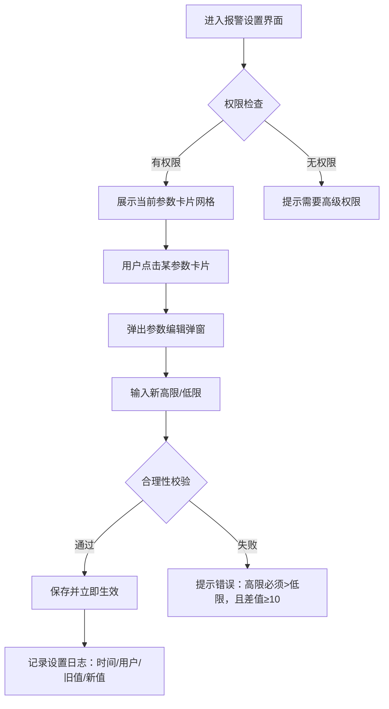
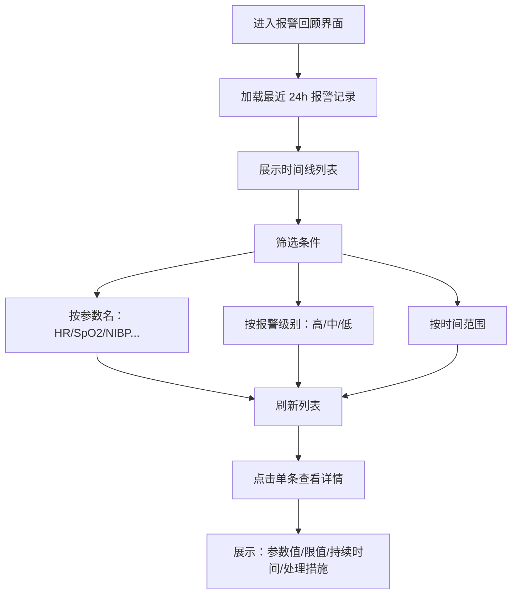

# 报警子系统设计文档

> 所属系统：监护仪嵌入式软件平台  
> 关联文档：`docs/project.md`（系统总览）  
> 下游功能规格：`test/alarm-limit-suggest/design-spec.md`

---

## 1. 概述

报警子系统是监护仪最核心的安全子系统，负责：
1. 实时监测生理参数是否超出安全阈值
2. 以声光方式提醒医护人员注意
3. 管理报警限值的设置与智能推荐
4. 记录报警历史，支持事后追溯

**设计原则**：
- **安全优先**：任何软件故障不得静默失效，必须降级到安全状态
- **可解释性**：所有报警和建议必须有明确的来源依据
- **低侵入性**：报警操作不得阻塞医护人员的其他工作流

---

## 2. 核心业务流程

### 2.1 报警触发流程

当生理参数实时值超出报警限时，系统触发报警。



**关键规则**：
- 去抖时间：参数需持续超出限值 **3 秒** 才触发报警（避免瞬间波动误报）
- 报警音分级：
  - 高危（红色）：连续急促音，不可静音
  - 中危（黄色）：间歇音，可静音 2 分钟
  - 低危（蓝色）：单次提示音
- 报警灯：独立硬件 LED，与软件状态双冗余

### 2.2 报警限设置流程

医护人员手动调整报警上下限。



**合理性校验规则**：
- 高限必须 > 低限
- 高限与低限差值 ≥ 10（避免阈值过窄导致频繁报警）
- 超出生理安全范围时弹警告（如 HR 高限 > 300）

### 2.3 报警限智能建议流程（新增 v1.2）

系统基于患者状态自动推荐合理的报警限调整。

```mermaid
flowchart TD
    A[触发时机] --> B{触发类型}
    B -->|主动| C[用户点击"智能建议"按钮]
    B -->|被动| D[患者状态变化：转科/诊断更新]
    B -->|定时| E[每 4 小时后台扫描]

    C --> F[SuggestionEngine.evaluate]
    D --> F
    E --> F

    F --> G[加载患者上下文]
    G --> H[PatientContextModel]
    H --> I[年龄/诊断/用药/当前参数值]

    F --> J[逐条评估规则]
    J --> K[RuleEvaluator]
    K --> L[JSON 规则匹配]
    L --> M[生成建议列表]

    M --> N{建议列表非空?}
    N -->|是| O[弹出建议弹窗]
    N -->|否| P[提示"当前报警限设置合理"]

    O --> Q[用户操作]
    Q -->|采纳| R[更新报警限 + 记录采纳日志]
    Q -->|忽略| S[记录忽略原因 + 24h 去重]
    Q -->|关闭| T[弹窗消失，无操作]
```

**规则优先级**：
1. 患者安全规则（如新生儿 HR 上限）：强制建议，不可忽略
2. 临床专家规则（如术后 HR 高限）：高置信度建议
3. 趋势预测规则（v2.0）：中置信度，需用户确认

### 2.4 报警暂停与恢复流程

医护人员可临时暂停非高危报警（如转运患者时）。

```mermaid
flowchart TD
    A[用户点击"暂停报警"按钮] --> B{是否有高危报警?}
    B -->|是| C[提示"高危报警不可暂停，请先处理"]
    B -->|否| D[弹出暂停时长选择]
    D --> E[选项：2min / 5min / 10min / 自定义]
    E --> F[启动倒计时]
    F --> G[期间所有中低危报警静默]
    G --> H{倒计时结束?}
    H -->|是| I[自动恢复报警]
    H -->|提前恢复| I
    I --> J[播放恢复提示音]
```

**安全约束**：
- 单次暂停最长 30 分钟
- 连续暂停超过 3 次/小时，系统弹警告并记录到审计日志
- 高危报警（如室颤）在任何情况下都不可暂停

### 2.5 报警历史查询流程



---

## 3. 模块边界

### 3.1 报警引擎 (AlarmEngine)

**输入**：
- 实时参数值（来自 ParameterCalculationService）
- 当前报警限（来自 AlarmConfigRepository）
- 患者上下文（来自 PatientContextService）

**输出**：
- 报警事件（AlarmEvent）：参数名/级别/开始时间/结束时间
- 音频控制指令（AudioCommand）：播放/停止/级别
- UI 状态指令（UIStateCommand）：高亮/闪烁/恢复

**不处理**：
- ❌ 参数原始计算（由 Waveform + Parameter 子系统负责）
- ❌ 患者信息录入（由 Patient 子系统负责）
- ❌ 网络数据推送（由 Network 子系统负责，Alarm 仅提供事件数据）

### 3.2 建议引擎 (SuggestionEngine)

**输入**：
- PatientContextModel（年龄/诊断/用药）
- 当前所有参数的报警限
- 规则 JSON 文件

**输出**：
- QList<Suggestion>：排序后的建议列表

**内部组件**：
- RuleEvaluator：规则加载与匹配
- SuggestionRecordModel：忽略记录查询（24h 去重）

---

## 4. 与其他子系统交互

| 子系统 | 交互方向 | 数据/事件 | 说明 |
|--------|---------|----------|------|
| **Parameter** | ← 输入 | 实时参数值 + 报警限 | AlarmEngine 订阅参数更新 |
| **Patient** | ← 输入 | 患者年龄/诊断/用药 | SuggestionEngine 读取患者上下文 |
| **UI** | → 输出 | 报警状态 + 建议弹窗数据 | Alarm 驱动 UI 显示，UI 回调用户操作 |
| **Network** | → 输出 | 报警事件日志 | Network 将报警事件推送到中央站 |
| **Waveform** | ← 输入 | 波形质量标记 | 波形质量差时，AlarmEngine 降低该参数报警级别 |

---

## 5. 数据模型

### 5.1 核心实体

```cpp
struct AlarmLimit {
    QString parameterName;      // "HR", "SpO2", "NIBP_Sys", "NIBP_Dia"
    double highLimit;
    double lowLimit;
    AlarmLevel level;           // High / Medium / Low
    QDateTime lastModified;
    QString modifiedBy;         // 用户名或"SYSTEM"
};

struct AlarmEvent {
    QString parameterName;
    double value;
    AlarmLevel level;
    QDateTime startTime;
    QDateTime endTime;          // 空表示仍在报警中
    QString alarmType;          // "HIGH_LIMIT" / "LOW_LIMIT"
};

struct Suggestion {
    QString parameterName;
    double currentHigh;
    double currentLow;
    double suggestedHigh;
    double suggestedLow;
    QString reason;
    QString ruleId;
    Confidence confidence;
    QDateTime generatedAt;
};
```

### 5.2 规则配置示例

```json
{
  "version": "1.2",
  "rules": [
    {
      "id": "neonate-hr-range",
      "name": "新生儿心率范围",
      "priority": 999,
      "category": "safety",
      "conditions": {
        "all": [
          { "field": "patient.age_months", "op": "<=", "value": 1 }
        ]
      },
      "actions": {
        "suggest": {
          "parameter": "HR",
          "highLimit": 180,
          "lowLimit": 80,
          "reason": "新生儿正常心率范围为 80-180 bpm",
          "confidence": "high",
          "mandatory": true
        }
      }
    },
    {
      "id": "post-op-hr-high",
      "name": "术后心率高限",
      "priority": 100,
      "category": "clinical",
      "conditions": {
        "all": [
          { "field": "patient.diagnoses", "op": "contains", "value": "术后" },
          { "field": "limits.HR.high", "op": "<", "value": 130 }
        ]
      },
      "actions": {
        "suggest": {
          "parameter": "HR",
          "highLimit": 130,
          "reason": "术后状态适当放宽心率高限",
          "confidence": "high"
        }
      }
    }
  ]
}
```

---

## 6. 关键设计决策

| 决策 | 选择 | 理由 |
|------|------|------|
| 报警去抖策略 | 3 秒持续超出 | 兼顾响应速度和抗干扰 |
| 报警音分级 | 高(不可静音) / 中(可暂停 2min) / 低(单次音) | 符合 IEC 60601-1-8 要求 |
| 规则引擎位置 | 本地嵌入式 | 医疗设备离线可用，数据不出设备 |
| 规则更新方式 | JSON 热重载 | 临床专家可调整，无需固件升级 |
| 建议弹窗形式 | 非模态悬浮 | 不中断护士当前操作 |
| 忽略去重策略 | 24h 内相同参数+相同规则不重复推送 | 避免反复打扰 |

---

## 7. 风险与限制

| 风险 | 影响 | 缓解措施 |
|------|------|---------|
| 规则覆盖不全导致漏建议 | 高 | v1.0 仅上线经临床验证的规则，逐步扩展 |
| 建议被过度依赖 | 高 | 明确标注"建议仅供参考，最终设置由医护人员决定" |
| 性能影响实时性 | 中 | 建议引擎独立线程，评估耗时 < 500ms |
| 跨病种规则冲突 | 中 | 规则优先级机制，安全规则（priority > 500）优先 |
