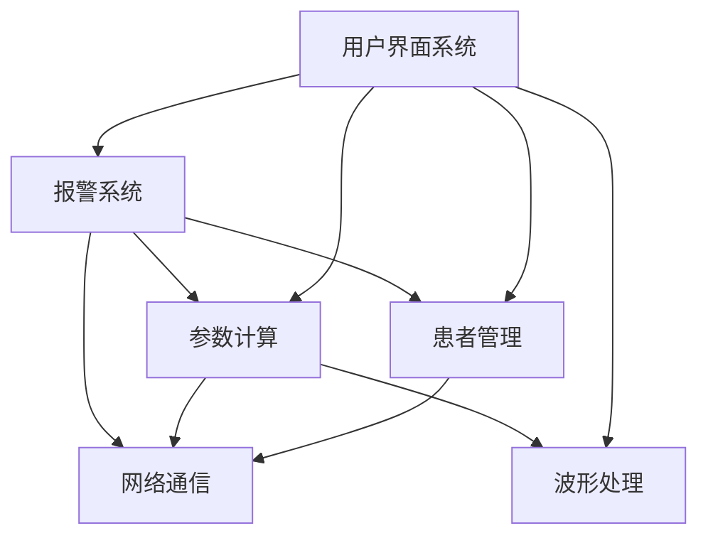

# Project Design Overview

## 项目信息

| 字段 | 内容 |
|------|------|
| 项目名称 | 监护仪嵌入式软件平台 |
| 项目目标 | 为临床医护提供稳定、智能、易用的患者监护解决方案 |
| 目标用户 | 临床医护人员（ICU、急诊、普通病房、新生儿科） |
| 当前阶段 | 持续迭代开发 |

---

## 技术栈

| 层级 | 技术 |
|------|------|
| 语言/框架 | C++17 + Qt5.15 + QML |
| 构建系统 | CMake 3.20+ |
| 数据库 | SQLite（本地配置缓存） |
| 测试框架 | GTest + Qt Test |
| 通信协议 | 私有串口协议 / HL7 / DICOM（选配） |

---

## 架构概述

### 核心架构模式
MVVM + Repository Pattern + Clean Architecture（分层）

### 模块结构

```
edan-monitor/
├── src/
│   ├── gui/              # UI 层 (QML + ViewModels)
│   ├── core/             # 业务核心 (Models + Services + UseCases)
│   ├── data/             # 数据层 (Repository + Database + Network)
│   └── platform/         # 平台抽象 (HAL + OS 适配)
├── tests/
│   ├── unit/
│   └── integration/
├── docs/                 # 设计文档总览
│   ├── project.md        # 本文档：系统总览 + 子系统索引
│   ├── alarm.md          # 报警子系统设计
│   ├── network.md        # 网络通信子系统设计
│   ├── patient.md        # 患者管理子系统设计
│   └── waveform.md       # 波形处理子系统设计
└── test/                 # 功能级设计规格
    └── {feature}/
        ├── design-spec.md    # 功能设计规格
        ├── project.md        # 功能上下文（可选）
        └── attachments/      # 需求文档/UI截图
```

---

## 子系统索引

子系统文档位于 `docs/` 目录下，每个子系统文档描述该域的**完整业务流程、模块边界、数据模型和关键决策**。

当进行特定功能设计时，先通过下表定位相关子系统，读取对应文档获取业务上下文。

| 子系统 | 文档路径 | 核心职责 | 包含的主要功能 | 状态 |
|--------|---------|---------|--------------|------|
| **报警系统** | `docs/alarm.md` | 报警触发、限值管理、建议生成、报警历史 | 报警触发、限值设置、智能建议、报警暂停、报警历史查询 | 持续迭代 |
| **网络通信** | `docs/network.md` | 设备间通信、中央站同步、远程监控 | 设备发现、数据推送、配置同步、远程固件升级 | 已上线 |
| **患者管理** | `docs/patient.md` | 患者信息、入院/转科/出院、诊断与用药 | 患者录入、ADT 事件、诊断管理、用药记录 | 已上线 |
| **波形处理** | `docs/waveform.md` | 生理信号采集、滤波、显示、存储与回放 | ECG/SpO2/RESP 实时处理、冻结、回顾、打印 | 已上线 |
| **参数计算** | `docs/parameter.md` | 生理参数实时计算、趋势分析、统计汇总 | HR/SpO2/NIBP/Temp 计算、趋势图、24h 统计 | 已上线 |
| **用户界面** | `docs/ui.md` | 界面框架、导航、主题、交互规范 | 主界面、菜单系统、主题切换、触控/旋钮适配 | 已上线 |

### 子系统间依赖关系



> **读取顺序**：当设计某个功能时，先读取涉及的主子系统文档，再读取其依赖的子系统文档。
>
> 例如：设计"报警限智能建议"功能时，读取顺序为：
> 1. `docs/alarm.md`（主系统）
> 2. `docs/patient.md`（依赖：获取患者诊断/用药/年龄）
> 3. `docs/parameter.md`（依赖：获取当前参数值和报警限）

---

## 设计文档规范

### 文档分层

| 层级 | 路径 | 内容 | 更新时机 |
|------|------|------|---------|
| **L1: 系统总览** | `docs/project.md` | 子系统索引、技术栈、全局架构 | 新增子系统时 |
| **L2: 子系统文档** | `docs/{subsystem}.md` | 业务流程、模块边界、数据模型、交互协议 | 业务流程变更时 |
| **L3: 功能规格** | `test/{feature}/design-spec.md` | 具体功能的实现方案、接口定义、测试用例 | 功能开发前 |

### 命名约定

- 子系统文档：`docs/{subsystem-name}.md`（小写，kebab-case）
- 功能目录：`test/{feature-name}/`（小写，kebab-case）
- 功能规格：`test/{feature}/design-spec.md`
- 附件目录：`test/{feature}/attachments/{requirements|ui|api}/`

---

## 关键设计决策（全局）

| 决策 | 选择 | 理由 | 影响子系统 |
|------|------|------|-----------|
| 数据层统一抽象 | Repository Pattern | 支持本地 SQLite / 远程中央站 / 文件导出的统一接口 | 全部 |
| 业务逻辑层 | UseCase Pattern | 每个业务操作封装为独立 UseCase，便于测试和复用 | 全部 |
| UI 层状态管理 | ViewModel + StateFlow | 单向数据流，避免 UI 直接操作 Model | GUI |
| 报警引擎位置 | 本地嵌入式 | 离线可用，数据不出设备 | Alarm |
| 通信协议 | 私有协议 + HL7 适配层 | 兼容自有设备和医院 HIS 系统 | Network |

---

## 外部依赖与约束

- **IEC 60601-1-8**: 报警系统安全标准（影响 Alarm）
- **HL7 FHIR R4**: 医院信息系统对接标准（影响 Network + Patient）
- **FDA 510(k)**: 软件变更控制要求（影响全部子系统的文档完整性）
- **性能约束**: 波形采样率 250Hz，端到端延迟 < 100ms（影响 Waveform + Parameter）

---

## 设计演进记录

| 日期 | 变更内容 | 影响范围 | 相关文档 |
|------|---------|---------|---------|
| 2026-05-07 | 新增报警限智能建议功能 | Alarm + GUI | `docs/alarm.md` / `test/alarm-limit-suggest/design-spec.md` |
| 2026-04-15 | 网络模块支持 DICOM 导出 | Network | `docs/network.md` |
| 2026-03-20 | 患者管理支持 ADT 事件订阅 | Patient + Network | `docs/patient.md` |

---

> 💡 **AI 读取指南**
>
> 1. 首先阅读本文档，了解系统全貌和子系统索引
> 2. 根据当前设计的功能，定位到相关子系统文档（L2）
> 3. 读取子系统文档，掌握业务流程和模块边界
> 4. 进入具体功能设计时，参考 L3 功能规格模板
> 5. 设计完成后，更新相关子系统文档（如有业务流程变更）
