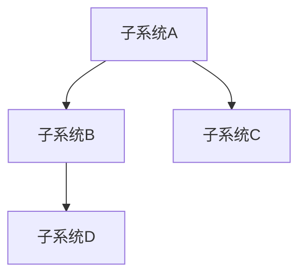

# Project Design Overview

## 项目信息

| 字段 | 内容 |
|------|------|
| 项目名称 | [在此处填写项目名称] |
| 项目目标 | [1-2句话描述项目要解决的核心问题] |
| 目标用户 | [谁在使用这个系统] |
| 当前阶段 | [设计 / 开发 / 维护] |

---

## 技术栈

| 层级 | 技术 |
|------|------|
| 语言/框架 | [如: C++17 + Qt5.15 / Kotlin + Android / Java + Spring Boot] |
| 构建系统 | [如: CMake / Gradle / Maven / QMake] |
| 数据库 | [如: SQLite / MySQL / PostgreSQL / 无] |
| 测试框架 | [如: GTest / JUnit 5 / pytest / Jest] |
| 其他关键依赖 | [列出核心第三方库] |

---

## 架构概述

### 核心架构模式
[如: MVVM / Clean Architecture / MVC / 分层架构]

### 模块结构

```
[在此处插入模块结构图或文字描述]

示例：
├── src/
│   ├── gui/          # UI 层 (QML + ViewModels)
│   ├── core/         # 业务核心 (Models + Services)
│   └── data/         # 数据层 (Repository + Database)
├── tests/            # 测试代码
├── docs/                      # 设计文档
│   ├── project.md             # 系统总览 + 子系统索引（本文档）
│   ├── alarm/                 # 报警子系统
│   │   ├── alarm.md           # 子系统设计框架
│   │   ├── alarm-rule/        # 业务流程：报警规则
│   │   │   └── design-spec.md
│   │   └── ...                # 其他业务流程
│   └── ...                    # 其他子系统
```

---

## 子系统索引

子系统文档位于 `docs/` 目录下，每个子系统文档描述该域的**完整业务流程、模块边界、数据模型和关键决策**。

当进行特定功能设计时，先通过下表定位相关子系统，读取对应文档获取业务上下文。

| 子系统 | 文档路径 | 核心职责 | 包含的主要功能 | 状态 |
|--------|---------|---------|--------------|------|
| [子系统A] | `docs/[subsystem-a]/[subsystem-a].md` | [职责描述] | [功能1, 功能2] | [设计中/已上线] |
| [子系统B] | `docs/[subsystem-b]/[subsystem-b].md` | [职责描述] | [功能3, 功能4] | [设计中/已上线] |
| ... | ... | ... | ... | ... |

### 子系统间依赖关系



> **读取顺序**：当设计某个功能时，先读取涉及的主子系统文档，再读取其依赖的子系统文档。
>
> 例如：设计"[功能X]"时，读取顺序为：
> 1. `docs/[主系统]/[主系统].md`（主系统）
> 2. `docs/[依赖系统]/[依赖系统].md`（依赖系统）
> 3. `docs/[主系统]/[功能X]/design-spec.md`（功能规格）

---

## 设计文档规范

### 文档分层

| 层级 | 路径 | 内容 | 更新时机 |
|------|------|------|---------|
| **L1: 系统总览** | `docs/project.md` | 子系统索引、技术栈、全局架构 | 新增子系统时 |
| **L2: 子系统设计** | `docs/{subsystem}/{subsystem}.md` | 业务流程索引、模块边界、数据模型、交互协议 | 业务流程变更时 |
| **L3: 功能规格** | `docs/{subsystem}/{flow}/design-spec.md` | 具体功能的实现方案、接口定义、测试用例 | 功能开发前 |

### 命名约定

- 子系统文件夹：`docs/{subsystem-name}/`（小写，kebab-case）
- 子系统文档：`docs/{subsystem}/{subsystem}.md`
- 业务流程文件夹：`docs/{subsystem}/{flow-name}/`（小写，kebab-case）
- 功能规格：`docs/{subsystem}/{flow}/design-spec.md`
- 附件目录：`docs/{subsystem}/{flow}/attachments/{requirements|ui|api}/`

---

## 关键设计决策

| 决策 | 选择 | 理由 | 影响子系统 |
|------|------|------|-----------|
| [决策1] | [方案A] | [为什么选这个] | [子系统A, 子系统B] |
| [决策2] | [方案B] | [为什么选这个] | [子系统C] |

---

## 外部依赖与约束

- [约束1: 如硬件限制、平台要求]
- [约束2: 如合规要求、安全标准]
- [约束3: 如与现有系统的集成要求]

---

## 设计演进记录

| 日期 | 变更内容 | 影响范围 | 相关文档 |
|------|---------|---------|---------|
| YYYY-MM-DD | [描述变更] | [影响的模块/组件] | [文档路径] |

---

> 💡 **使用说明**
>
> 本文档由 AI 辅助生成，应根据项目实际情况持续更新。
> 每次重大架构变更后，请同步更新此文件。
>
> **AI 读取指南**：
> 1. 首先阅读本文档，了解系统全貌和子系统索引
> 2. 根据当前设计的功能，定位到相关子系统文件夹和子系统设计文档（L2）
> 3. 读取子系统文档，掌握业务流程索引、模块边界和数据模型
> 4. 进入具体功能设计时，定位到 `docs/{subsystem}/{flow}/design-spec.md`（L3）
> 5. 设计完成后，更新相关子系统文档（如有新增业务流程，需更新索引）
>
> 生成时间: [自动生成]
