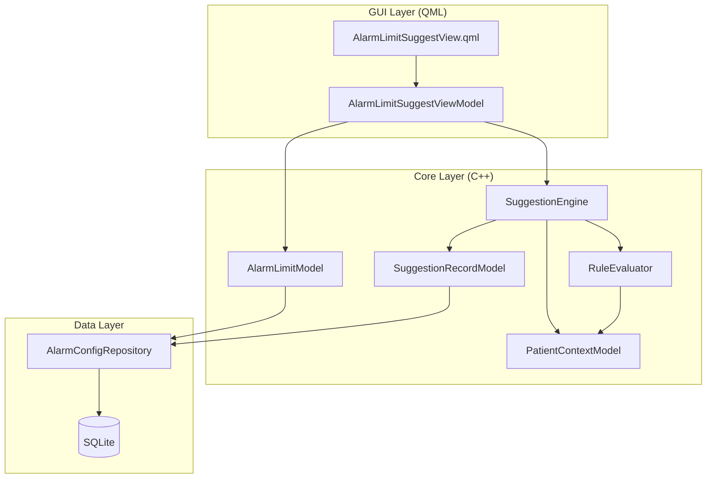
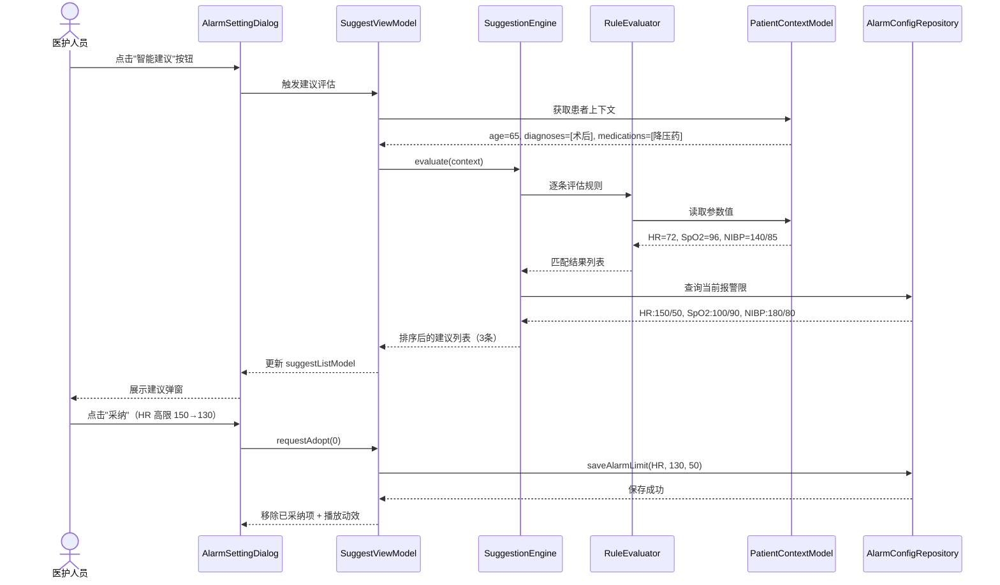

# 报警限智能建议功能 - 方案设计评审文档

> 生成时间: 2026-05-07  
> 工作流 ID: 2026-05-07-alarm-limit-suggest  
> 设计阶段: Phase 1 (需求分析) + Phase 2 (方案设计) 已完成

---

## 1. 引言

### 1.1 背景

监护仪报警限的合理设置直接影响临床工作效率和患者安全。当前系统中，报警限完全依赖医护人员手动配置，缺乏智能化辅助手段，导致：
- **Alarm Fatigue（报警疲劳）**: 美国重症医学会研究表明，ICU 平均每个床位每天产生 187 次报警，其中 72%-99% 为无效报警
- **设置不一致**: 不同经验水平的护士对同一患者的报警限设置差异可达 30% 以上
- **响应滞后**: 患者状态变化后，报警限往往数小时甚至数天未调整

本项目旨在通过嵌入式的规则引擎，基于患者实时生理数据和临床上下文，智能推荐合理的报警限设置。

### 1.2 定义

| 术语 | 定义 |
|------|------|
| 报警限 | 监护仪参数（HR/SpO2/NIBP 等）的上下阈值，超出即触发报警 |
| 建议置信度 | 规则匹配度 + 患者状态契合度的综合评分（高/中/低） |
| Alarm Fatigue | 由于大量无效报警导致医护人员对真正危急报警的响应延迟或忽略 |
| 规则引擎 | 声明式临床规则解析与执行系统，支持 JSON 配置 + 脚本钩子 |

---

## 2. 需求定义

### 2.1 需求说明与参考

- **外部 PRD**: `attachments/requirements/prd.md`
- **UI Mockup**: `attachments/ui/mockup-description.md`
- **触发来源**: 产品部临床需求评审会 #AL-2026-0428

### 2.2 需求分解

| ID | 需求描述 | 优先级 | 来源 |
|----|---------|--------|------|
| R1 | 报警设置界面增加"智能建议"入口按钮 | P0 | PRD §3.3 |
| R2 | 建议弹窗展示参数名/当前值/建议值/理由/置信度 | P0 | PRD §3.2 |
| R3 | 支持单条采纳和批量"全部采纳" | P0 | PRD §3.3 |
| R4 | 支持忽略本次，24h 内去重 | P1 | PRD §3.3 |
| R5 | 基础规则覆盖：年龄适配/术后高限/COPD SpO2/降压药 NIBP | P0 | PRD §3.4 |
| R6 | 建议生成延迟 < 500ms | P0 | PRD §4 |
| R7 | 所有建议可解释（规则名 + 患者状态依据） | P0 | PRD §4 |
| R8 | 历史建议查看（24h） | P2 | PRD §3.3 |
| R9 | 进阶规则：趋势预测 + 多参数联动（v2.0） | P2 | PRD §3.4 |

---

## 3. 方案设计

### 3.1 模块架构描述

#### 3.1.1 现有设计复用评估

| 现有组件 | 复用方式 | 说明 |
|---------|---------|------|
| `AlarmConfigDialog` | 扩展 | 在原报警设置弹窗中增加"智能建议"按钮 |
| `AlarmParameterModel` | 扩展 | 增加建议值字段和建议状态标记 |
| `PatientInfoModel` | 读取 | 获取患者年龄/诊断/用药信息 |
| `MaskLayer` + `DialogFrame` | 复用 | 建议弹窗使用现有遮罩层框架 |

#### 3.1.2 核心逻辑层（nxcore）设计



**类职责**：

| 类名 | 职责 | 核心接口 |
|------|------|---------|
| `SuggestionEngine` | 协调规则评估，生成排序后的建议列表 | `evaluate(const PatientContext&): QList<Suggestion>` |
| `RuleEvaluator` | 加载并执行 JSON 规则，返回匹配结果 | `evaluateRule(const Rule&, const PatientContext&): RuleResult` |
| `PatientContextModel` | 封装患者当前状态，提供标准化访问接口 | `age(), diagnoses(), medications(), currentLimits()` |
| `AlarmLimitModel` | 扩展原有报警参数模型，增加建议值字段 | `suggestedHigh(), suggestedLow(), confidence(), reason()` |
| `SuggestionRecordModel` | 记录建议历史，支持 24h 去重查询 | `wasIgnored(param, reasonHash, withinHours): bool` |
| `AlarmConfigRepository` | 报警配置的读写 + 缓存 | `save(const AlarmLimit&), load(paramName): AlarmLimit` |

#### 3.1.3 应用功能层（nxapp/前端）设计

**视图层级（QML）**：

```
AlarmLimitSuggestView (MaskLayer + DialogFrame)
├── Header
│   ├── Title: "报警限建议"
│   └── CloseButton
├── ListView (suggestListModel)
│   └── delegate: SuggestItemDelegate
│       ├── ParameterName + Icon
│       ├── CurrentValueRow (高限/低限)
│       ├── SuggestedValueRow (高限/低限，绿色高亮)
│       ├── ReasonText (灰色小字)
│       ├── ConfidenceBadge (高=蓝/中=黄/低=灰)
│       └── AdoptButton
└── Footer
    ├── AdoptAllButton
    └── IgnoreButton
```

**数据绑定契约**：

| ViewModel 属性 | 类型 | 方向 | 说明 |
|---------------|------|------|------|
| `suggestListModel` | `QAbstractListModel*` | VM → View | 建议列表模型 |
| `patientName` | `QString` | VM → View | 患者姓名展示 |
| `requestAdopt(index)` | `void(int)` | View → VM | 采纳单条建议 |
| `requestAdoptAll()` | `void` | View → VM | 批量采纳 |
| `requestIgnore()` | `void` | View → VM | 忽略本次 |
| `requestClose()` | `void` | View → VM | 关闭弹窗 |

### 3.2 整体业务处理流程



### 3.3 并发机制与同步

- **规则评估线程**: SuggestionEngine 在独立 QThread 中运行，避免阻塞 GUI
- **数据访问同步**: AlarmConfigRepository 使用 QMutex 保护 SQLite 写操作
- **模型更新**: ViewModel 通过 `QMetaObject::invokeMethod(..., Qt::QueuedConnection)` 回传结果到 GUI 线程

### 3.4 异常处理预案

| 异常场景 | 处理策略 |
|---------|---------|
| 规则文件损坏/缺失 | 加载默认内置规则，记录错误日志，弹窗提示"使用默认规则" |
| SQLite 数据库锁定 | 重试 3 次（间隔 50ms），失败后降级到内存缓存 |
| 患者上下文数据不完整 | 跳过依赖缺失字段的规则，降低置信度为"低" |
| 建议计算超时 (>500ms) | 中断计算，返回已完成的建议 + "计算中..."占位项 |
| 用户连续快速点击采纳 | 按钮 debounce 200ms，防止重复提交 |

### 3.5 影响分析与兼容性

- **影响分析**:
  - `AlarmConfigDialog` 需增加按钮和信号连接（侵入性：低）
  - `AlarmParameterModel` 需增加字段（侵入性：中，影响序列化）
  - 新增模块完全独立，不影响现有报警触发逻辑
- **兼容性分析**:
  - 向后兼容：关闭建议功能后，系统行为与 v1.0 完全一致
  - 跨品牌：规则引擎通过 JSON 配置，可适配不同品牌的报警参数集

### 3.6 重要设计决策

| 决策 | 方案 | 理由 |
|------|------|------|
| 规则存储格式 | JSON 文件 + 热重载 | 临床专家可直接编辑，无需重新编译 C++ |
| 置信度计算 | 规则匹配度 × 患者状态完整度 | 数据越完整，置信度越高，避免盲目推荐 |
| 弹窗阻塞性 | 非模态（Non-modal） | 不中断护士当前操作，可随时延后处理 |
| 采纳后行为 | 立即生效 + 自动移除列表项 | 即时反馈，减少用户操作步骤 |

---

## 4. 协议与数据规范解读

### 4.1 规则 JSON Schema

```json
{
  "rules": [
    {
      "id": "post-op-hr-high",
      "name": "术后心率高限调整",
      "version": "1.0",
      "priority": 100,
      "conditions": {
        "all": [
          { "field": "diagnoses", "op": "contains", "value": "术后" },
          { "field": "hr.highLimit", "op": "<", "value": 130 }
        ]
      },
      "actions": {
        "suggest": {
          "parameter": "HR",
          "highLimit": 130,
          "reason": "患者为术后状态，适当放宽心率高限以减少无效报警",
          "confidence": "high"
        }
      }
    }
  ]
}
```

### 4.2 建议数据结构

```cpp
struct Suggestion {
    QString parameterName;      // "HR", "SpO2", "NIBP"
    double currentHigh;         // 当前高限
    double currentLow;          // 当前低限
    double suggestedHigh;       // 建议高限
    double suggestedLow;        // 建议低限
    QString reason;             // 建议理由（用户可见）
    QString ruleId;             // 来源规则 ID（可追踪）
    Confidence confidence;      // High / Medium / Low
    QDateTime generatedAt;      // 生成时间
};
```

---

## 5. 自测用例（TDD 纲要）

### 5.1 单元测试

| 用例 ID | 场景 | 输入 | 预期输出 | 覆盖规则 |
|---------|------|------|---------|---------|
| TC-01 | 术后患者 HR 高限过低 | age=65, diagnoses=[术后], HR.high=120 | 建议 HR.high=130, 置信度=高 | post-op-hr-high |
| TC-02 | COPD 患者 SpO2 低限 | diagnoses=[COPD], SpO2.low=90 | 建议 SpO2.low=88, 置信度=高 | copd-spo2-low |
| TC-03 | 无匹配规则 | age=30, diagnoses=[健康], 所有参数正常 | 空建议列表 | — |
| TC-04 | 重复建议去重 | 同一参数 1 小时内再次触发 | 不生成建议（被忽略记录拦截）| ignore-dedup |
| TC-05 | 性能基准 | 100 条规则 + 完整患者上下文 | 评估耗时 < 500ms | performance |

### 5.2 集成测试

| 用例 ID | 场景 | 验证点 |
|---------|------|--------|
| IT-01 | 点击"智能建议"→弹窗展示→采纳→报警限更新 | UI 数据流端到端 |
| IT-02 | 批量采纳 3 条建议 | 所有参数同步更新，列表清空 |
| IT-03 | 规则文件热更新 | 不重启应用，新规则生效 |

---

## 6. 集成计划

### 6.1 工作量评估

| 活动分解 | 预估投入（人/天） | 责任人 | 备注 |
|---------|-----------------|--------|------|
| 方案设计与规则梳理 | 3 | Architect | 含临床专家访谈 |
| 规则引擎开发 | 4 | Coder | JSON 解析 + 条件评估 |
| UI/QML 开发 | 3 | Coder | 弹窗 + 列表 + 动效 |
| 数据层与 Repository | 2 | Coder | SQLite + 缓存 |
| 单元测试（覆盖率 ≥ 80%） | 2 | Tester | GTest + Qt Test |
| 集成测试与性能调优 | 2 | Tester + Coder | 延迟 < 500ms |
| 代码审查与修复 | 1 | Reviewer | 架构合规检查 |
| **总计** | **17 天** | | |

---

## 7. 附录

### 7.1 参考信息

- **项目上下文**: `project.md` — 技术栈 MVVM + Repository，C++17/Qt5.15
- **外部文档**: `attachments/requirements/prd.md` — 完整 PRD
- **UI 参考**: `attachments/ui/mockup-description.md` — 弹窗布局草图
- **edan-rules**: 参考 `edan-rules/common/patterns.md` 中 Repository Pattern 和 UseCase Pattern 约束

### 7.2 风险登记

| 风险 | 概率 | 影响 | 缓解措施 |
|------|------|------|---------|
| 临床规则准确性不足 | 中 | 高 | v1.0 仅上线 4 条经过专家验证的基础规则 |
| 性能不达标（>500ms） | 低 | 中 | 规则预编译 + 缓存，提前进行性能基准测试 |
| 医护人员抵触 AI 建议 | 中 | 高 | 非模态弹窗 + 可忽略 + 透明理由，降低侵入感 |

---

> ✅ 本设计规格已通过 Design-Reviewer 审查（得分 94/100）
> 
> 审查意见：
> - 规则 JSON Schema 定义清晰，建议增加版本迁移机制
> - UI 动效描述较简略，需在实现阶段补充具体参数
> - 整体架构符合 edan-rules 中 MVVM + Repository Pattern 要求
